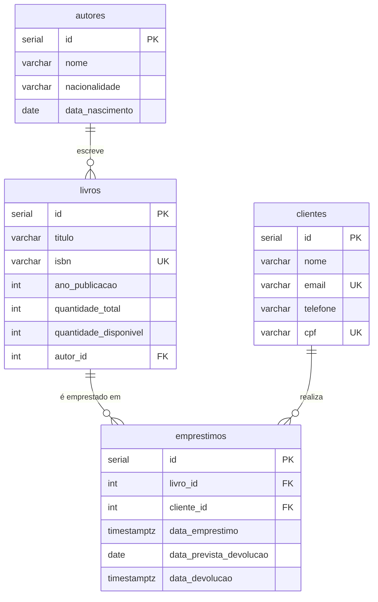
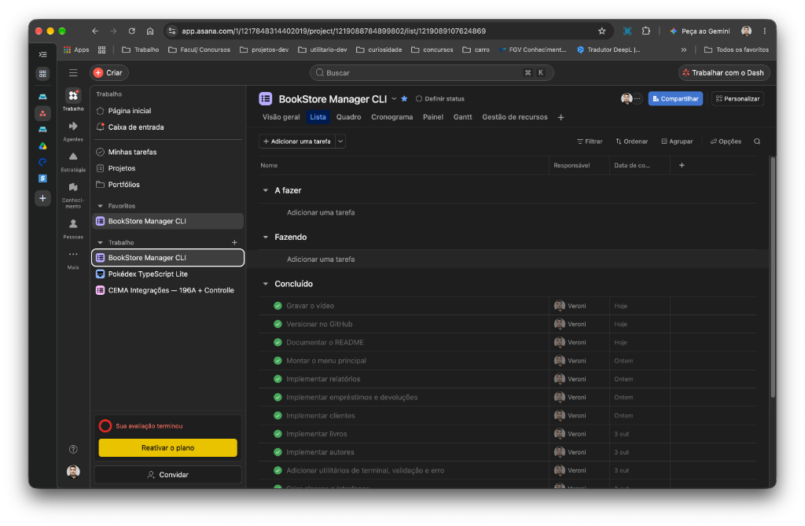

# BookStore Manager CLI

Aplicação de linha de comando (CLI) para gerenciar uma livraria: cadastro de autores, livros e clientes, controle de empréstimos e devoluções com atualização de estoque e relatórios gerenciais. Desenvolvida em **Node.js + TypeScript**, com **PostgreSQL** e SQL nativo pela biblioteca `pg`.

Projeto final do Módulo 1 (SCTEC).

## Objetivo

Aplicar, em um sistema completo e executável no terminal:

- arquitetura em camadas com responsabilidades separadas;
- modelagem relacional com chaves primárias, estrangeiras e restrições;
- CRUD com SQL nativo e consultas parametrizadas;
- consultas relacionais (`INNER JOIN`, `LEFT JOIN`, `GROUP BY`, `ORDER BY`, `LIMIT`, `COUNT`, `SUM`);
- transações para manter o estoque consistente;
- recursos de tipagem do TypeScript;
- versionamento com Git, branches e commits semânticos.

## Tecnologias utilizadas

| Tecnologia | Uso |
|---|---|
| Node.js (18 ou superior) | ambiente de execução |
| TypeScript 5 | linguagem, com `strict` ativado |
| PostgreSQL 16 | banco de dados relacional |
| [pg](https://node-postgres.com/) | conexão e consultas SQL |
| dotenv | leitura das variáveis do arquivo `.env` |
| tsx | execução do TypeScript em desenvolvimento |
| Docker (opcional) | execução do PostgreSQL em contêiner |

## Requisitos para execução

- Node.js 18 ou superior e npm;
- PostgreSQL 14 ou superior, instalado localmente **ou** via Docker;
- Git.

## Instalação

```bash
git clone https://github.com/VeroniJrStudant/bookstore-manager.git
cd bookstore-manager
npm install
cp .env.example .env
```

## Configuração do banco de dados

### 1. Ter um PostgreSQL rodando

**Opção A: Docker** (o mesmo ambiente usado no desenvolvimento):

```bash
docker run --name bookstore-postgres \
  -e POSTGRES_PASSWORD=postgres \
  -p 5432:5432 \
  -v bookstore_pg:/var/lib/postgresql/data \
  -d postgres:16
```

**Opção B: PostgreSQL instalado na máquina.** Basta ajustar usuário e senha no `.env`.

### 2. Conferir o `.env`

| Variável | Padrão | Descrição |
|---|---|---|
| `DB_HOST` | `localhost` | endereço do PostgreSQL |
| `DB_PORT` | `5432` | porta |
| `DB_USER` | `postgres` | usuário |
| `DB_PASSWORD` | `postgres` | senha |
| `DB_NAME` | `livraria_cli` | banco da aplicação |
| `DB_ADMIN_DB` | `postgres` | banco usado só para criar o `DB_NAME` |

O `.env` não é versionado. O modelo está em `.env.example`.

### 3. Criar o banco e as tabelas

```bash
npm run db:seed
```

Esse comando cria o banco `livraria_cli` se ele não existir, executa `database/schema.sql` (tabelas, chaves e restrições) e `database/seed.sql` (dados de exemplo).

| Comando | O que faz |
|---|---|
| `npm run db:setup` | cria o banco (se necessário) e executa só o `schema.sql` |
| `npm run db:seed` | faz o mesmo e carrega os dados de exemplo. **Apaga os dados atuais** e reinicia os códigos |

Alternativa manual com `psql`:

```bash
psql -U postgres -c "CREATE DATABASE livraria_cli"
psql -U postgres -d livraria_cli -f database/schema.sql
psql -U postgres -d livraria_cli -f database/seed.sql
```

A pasta `database/csv/` contém os mesmos dados de exemplo do `seed.sql` em formato CSV, um arquivo por tabela.

## Execução

```bash
npm run dev
```

Versão compilada:

```bash
npm run build
npm start
```

| Script | Comando |
|---|---|
| `dev` | `tsx src/main.ts` |
| `build` | `tsc` (gera JavaScript em `dist/`) |
| `start` | `node dist/main.js` |
| `db:setup` | prepara o banco sem dados |
| `db:seed` | prepara o banco com dados de exemplo |

## Arquitetura do projeto

```text
Menu  →  Controller  →  Service  →  Repository  →  PostgreSQL
```

| Camada | Pasta | Responsabilidade |
|---|---|---|
| Menus | `src/menus` | exibem as opções e chamam o controller |
| Controllers | `src/controllers` | fazem perguntas no terminal e exibem resultados em tabela |
| Services | `src/services` | regras de negócio e validações |
| Repositories | `src/repositories` | **único** lugar com SQL; convertem linhas do banco em objetos |
| Models | `src/models` | interfaces e classes das entidades |
| Utils | `src/utils` | terminal, validações, formatação e tratamento de erros |
| Database | `src/database` | conexão (`Pool`), transações e preparação do banco |

Decisões técnicas:

- **Consultas parametrizadas** (`$1`, `$2`...) em todo o SQL, evitando SQL injection.
- **Transações** (`BEGIN` / `COMMIT` / `ROLLBACK`) no empréstimo e na devolução: a baixa do estoque e o registro do empréstimo acontecem juntos ou não acontecem.
- **Estoque atômico:** `UPDATE ... WHERE quantidade_disponivel > 0` impede emprestar o último exemplar duas vezes.
- **Erros do banco traduzidos:** violações de `UNIQUE` (código `23505`) e de chave estrangeira (`23503`) viram mensagens claras para o usuário.
- **Nenhuma operação derruba o programa:** cada ação do menu roda dentro de `try/catch` (`executarOperacao`) e mostra o erro antes de voltar ao menu.
- **Datas** em `AAAA-MM-DD` no fuso `America/Sao_Paulo`.

## Modelo de dados



Restrições definidas em `database/schema.sql`:

- `CHECK`: quantidade total maior que zero, quantidade disponível entre zero e o total, devolução posterior ao empréstimo;
- `UNIQUE`: ISBN do livro, e-mail e CPF do cliente;
- índices nas chaves estrangeiras.

## Funcionalidades implementadas

**Autores:** listar, buscar por código, cadastrar, atualizar e remover. Não permite remover autor com livros.

**Livros:** listar com o nome do autor (`INNER JOIN`), buscar, cadastrar, atualizar e remover.
- ISBN com 10 ou 13 dígitos e único;
- ano entre 1450 e o ano atual;
- o autor precisa existir;
- ao alterar a quantidade total, os disponíveis são ajustados, e o total não pode ficar menor que os exemplares emprestados;
- não permite remover livro com empréstimos.

**Clientes:** listar, buscar, cadastrar, atualizar e remover.
- e-mail e CPF únicos;
- CPF validado pelos dígitos verificadores;
- telefone com DDD;
- dados gravados só com dígitos e exibidos formatados;
- não permite remover cliente com empréstimos.

**Empréstimos:** listar todos, listar ativos, registrar empréstimo e registrar devolução.
- livro e cliente precisam existir;
- só empresta livro com exemplar disponível;
- devolução prevista não pode ser anterior a hoje;
- não permite devolver duas vezes;
- estoque atualizado dentro de transação.

**Relatórios:**

| Relatório | Recursos de SQL |
|---|---|
| Livros disponíveis | `INNER JOIN`, `WHERE`, `ORDER BY` |
| Livros emprestados | dois `INNER JOIN`, `WHERE ... IS NULL` |
| Livros cadastrados por autor | `LEFT JOIN`, `GROUP BY`, `COUNT`, `SUM`, `COALESCE` |
| Empréstimos por livro (5 mais emprestados) | `LEFT JOIN`, `GROUP BY`, `COUNT`, `LIMIT` |
| Clientes com empréstimos ativos | `INNER JOIN`, `GROUP BY`, `COUNT` |

**Recursos de TypeScript utilizados:** interfaces e herança de interfaces (`DadosLivro` → `ILivro`), classes com `implements`, propriedades `readonly` no construtor, getter (`get situacao()`), tipo literal (`"ativo" | "devolvido"`), generics (`consultar<T>`, `executarTransacao<T>`, `mostrar<T>`), type guard (`erro is ErroPostgres`), tipos `never` e `unknown`, `Record` e funções de ordem superior.

## Estrutura de pastas

```text
bookstore-manager/
├── database/
│   ├── schema.sql          # criação das tabelas, chaves, restrições e índices
│   ├── seed.sql            # dados de exemplo
│   └── csv/                # dados de exemplo em CSV (um arquivo por tabela)
├── src/
│   ├── main.ts             # ponto de entrada
│   ├── controllers/        # entrada e saída no terminal
│   ├── database/           # conexão, transação e preparação do banco
│   ├── menus/              # menu principal e submenus
│   ├── models/             # interfaces e classes das entidades
│   ├── repositories/       # SQL
│   ├── services/           # regras de negócio
│   ├── testes/             # scripts de teste manual de cada módulo
│   └── utils/              # terminal, validação, formatação e erros
├── .env.example
├── package.json
├── tsconfig.json
└── README.md
```

## Exemplos de utilização

Menu principal:

```text
========================================
         BookStore Manager CLI
========================================

===== Menu principal =====
1 - Autores
2 - Livros
3 - Clientes
4 - Empréstimos
5 - Relatórios
0 - Sair
Escolha uma opção:
```

Listagem de livros (menu **2 → 1**):

```text
┌─────────┬────────┬───────────────────────────────────┬───────────────────────┬─────────────────┬──────┬───────┬─────────────┐
│ (index) │ Código │ Título                            │ Autor                 │ ISBN            │ Ano  │ Total │ Disponíveis │
├─────────┼────────┼───────────────────────────────────┼───────────────────────┼─────────────────┼──────┼───────┼─────────────┤
│ 0       │ 3      │ 'A Hora da Estrela'               │ 'Clarice Lispector'   │ '9788532508126' │ 1977 │ 2     │ 2           │
│ 1       │ 1      │ 'Capitães da Areia'               │ 'Jorge Amado'         │ '9788535914061' │ 1937 │ 1     │ 0           │
│ 2       │ 2      │ 'Dom Casmurro'                    │ 'Machado de Assis'    │ '9788594318602' │ 1899 │ 3     │ 2           │
│ 3       │ 4      │ 'Grande Sertão: Veredas'          │ 'João Guimarães Rosa' │ '9788501114775' │ 1956 │ 4     │ 4           │
│ 4       │ 5      │ 'Memórias Póstumas de Brás Cubas' │ 'Machado de Assis'    │ '9788594318619' │ 1881 │ 2     │ 2           │
└─────────┴────────┴───────────────────────────────────┴───────────────────────┴─────────────────┴──────┴───────┴─────────────┘
```

Registro de empréstimo (menu **4 → 3**):

```text
Livros com exemplares disponíveis:
  3 - A Hora da Estrela (2 disponível(is))
  2 - Dom Casmurro (2 disponível(is))
  4 - Grande Sertão: Veredas (4 disponível(is))
  5 - Memórias Póstumas de Brás Cubas (2 disponível(is))
Código do livro: 4
Clientes cadastrados:
  1 - Ana Souza
  2 - Bruno Lima
  3 - Carla Mendes
Código do cliente: 2
Data prevista de devolução (AAAA-MM-DD): 2026-10-20

Empréstimo registrado: #4 Grande Sertão: Veredas - Bruno Lima (ativo)
```

Erros tratados:

```text
Erro: Não há exemplares disponíveis deste livro.
Erro: Já existe um livro com este ISBN.
Erro: Já existe um cliente com este CPF.
Erro: Autor não encontrado.
Erro: Não é possível remover: o autor possui livros cadastrados.
Erro: Este empréstimo já foi devolvido.
Erro: Não foi possível acessar o banco. Confira o .env e se o PostgreSQL está ligado.
```

Para testar um módulo isoladamente, cada um tem um script em `src/testes/`:

```bash
npx tsx src/testes/testeAutores.ts
```

## Versionamento

Fluxo usado: cada funcionalidade em uma branch criada a partir da `develop`, integrada com `git merge --no-ff`. Ao final, a `develop` foi integrada na `main`.

Branches: `main`, `develop`, `feat/autores`, `feat/livros`, `feat/clientes`, `feat/emprestimos`, `feat/relatorios`, `feat/menu-principal` e `docs/readme`.

Os commits seguem o padrão [Conventional Commits](https://www.conventionalcommits.org/pt-br/) (`feat:`, `fix:`, `refactor:`, `test:`, `docs:`, `chore:`).

## Integrantes

- **Veroni Júnior** ([@VeroniJrStudant](https://github.com/VeroniJrStudant))

## Kanban

Planejamento e acompanhamento das tarefas no Asana: [BookStore Manager CLI](https://app.asana.com/1/1217848314402019/project/1219088784899802/list)

> O quadro do Asana exige login. Abaixo, o estado final do Kanban:


